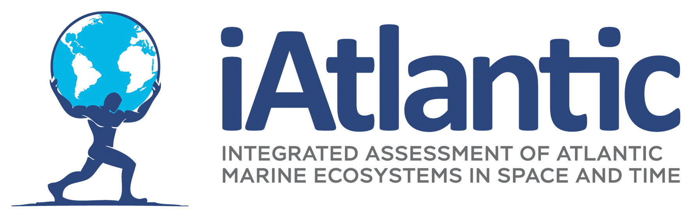

</img>
# iAtlantic GeoNode 101
## Tier 2: How to use the iAtlantic GeoNode?
# iAtlantic GeoNode 101
## Tier 2: How to use OGC webservices offered by the iAtlantic GeoNode in your data analysis

**Duration:** 40 min

**Target audience:** this workshop will make use of Python Notebooks and common GIS Software, basic knowledge of python and/or GIS software is recommended.

**Content:**

* Introduction to OGC services
* Search through metadata using the OGC Catalogue Service (CSW)
* Visualize data using OGC Web Mapping Service (WMS)
* Subset and download data using OGC Web Feature and Coverage Services (WFS & WCS)
* Use OGC services with QGIS and/or ArcGIS

